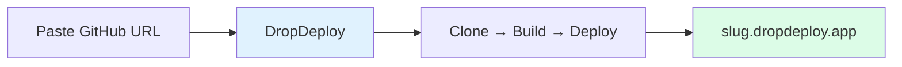
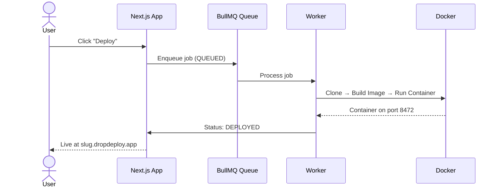

# DropDeploy

Deploy projects instantly by **pasting a GitHub repository URL**. The system clones, builds, containerizes, and hosts your project — returning a live subdomain URL.



---

## Features

- **GitHub deployment** -- Deploy from any public repository URL
- **Framework detection** -- Static (HTML), Node.js, Next.js, Django
- **Containerized builds** -- Each deployment runs in an isolated Docker container
- **Live URLs** -- Subdomain per project (`https://{slug}.dropdeploy.app`)
- **Branch switching** -- Choose which branch to deploy, switch between deploys
- **Build progress** -- Step-by-step indicators (cloning → building → starting)
- **Interactive terminal** -- Run commands inside deployed containers with slash commands
- **Local network access** -- Access deployed apps from other devices on your network
- **Authentication** -- Email/password with JWT sessions

---

## Tech Stack

| Layer | Technologies |
|-------|-------------|
| **Frontend** | Next.js 16 (App Router), React, shadcn/ui, Tailwind CSS |
| **Backend** | Next.js API Routes, Prisma ORM, PostgreSQL, Redis, BullMQ |
| **Infrastructure** | Docker (dockerode), Nginx (reverse proxy), simple-git |

---

## Prerequisites

- **Node.js** 18+
- **PostgreSQL** (local or remote)
- **Redis** (for BullMQ job queue)
- **Docker** daemon running

---

## Getting Started

### 1. Clone and install

```bash
git clone <repository-url>
cd dropDeploy
npm install
```

### 2. Environment variables

```bash
cp .env.example .env
```

Edit `.env` and configure:

| Variable | Description |
|----------|-------------|
| `DATABASE_URL` | PostgreSQL connection string |
| `JWT_SECRET` | Secret for JWT signing (32+ chars recommended) |
| `REDIS_HOST` / `REDIS_PORT` | Redis connection (defaults: `localhost`, `6379`) |

See [.env.example](.env.example) for all options.

### 3. Database setup

```bash
# Create DB (if it doesn't exist)
createdb dropdeploy

# If your DB user needs schema permissions:
psql -d dropdeploy -f scripts/fix-db-permissions.sql

# Apply schema and generate client
npx prisma generate
npx prisma db push
```

### 4. Run the app

**Development** (two terminals):

```bash
npm run dev      # Terminal 1: Next.js dev server
npm run worker   # Terminal 2: BullMQ deployment worker
```

Open [http://localhost:3000](http://localhost:3000). Sign up to access the dashboard.

**Production:**

```bash
npm run build && npm start
```

---

## How It Works



1. **Create project** -- Provide a name, GitHub URL, and framework type.
2. **Deploy** -- Click "Deploy" to queue a build job.
3. **Worker builds** -- The BullMQ worker clones the repo, builds a Docker image, and starts a container.
4. **Live URL** -- Access your app at `https://{slug}.dropdeploy.app` or via local network URL.

---

## Scripts

| Script | Description |
|--------|-------------|
| `npm run dev` | Start Next.js dev server |
| `npm run build` | Production build |
| `npm start` | Start production server |
| `npm run type-check` | Run TypeScript check |
| `npm run lint` | Run ESLint |
| `npm run db:generate` | Generate Prisma client |
| `npm run db:push` | Push schema to DB (no migrations) |
| `npm run db:migrate` | Run Prisma migrations |
| `npm run db:studio` | Open Prisma Studio |
| `npm run worker` | Start deployment queue worker |

---

## Project Structure

```
dropDeploy/
├── src/
│   ├── app/              # Next.js App Router (auth, dashboard, API routes)
│   ├── components/       # UI primitives (shadcn), features, layouts
│   ├── hooks/            # Custom React hooks
│   ├── lib/              # Utils, Prisma, Redis, queue, auth, config
│   ├── repositories/     # Data access (User, Project, Deployment)
│   ├── services/         # Business logic (auth, project, deployment, docker, git)
│   ├── types/            # TypeScript types & DTOs
│   ├── validators/       # Zod schemas
│   └── workers/          # BullMQ deployment worker
├── prisma/               # Database schema
├── docker/               # Nginx configs, Dockerfile templates
├── scripts/              # Dev setup, DB permissions
└── docs/                 # Documentation
```

For a detailed breakdown, see [docs/ARCHITECTURE.md](docs/ARCHITECTURE.md).

---

## Environment Variables

| Variable | Required | Description |
|----------|----------|-------------|
| `DATABASE_URL` | Yes | PostgreSQL connection string |
| `JWT_SECRET` | Yes | Secret for JWT signing |
| `JWT_EXPIRES_IN` | No | Token expiry (default: `7d`) |
| `REDIS_HOST` | No | Redis host (default: `localhost`) |
| `REDIS_PORT` | No | Redis port (default: `6379`) |
| `NEXT_PUBLIC_APP_URL` | No | Public app URL for links |
| `BASE_DOMAIN` | No | Base domain for deployment subdomain URLs |
| `DOCKER_SOCKET` | No | Docker socket path |
| `NGINX_CONFIG_PATH` | No | Nginx config path for subdomain routing |
| `PROJECTS_DIR` | No | Cloned repo storage (default: `~/.dropdeploy/projects`) |
| `DOCKER_DATA_DIR` | No | Docker data storage (default: `~/.dropdeploy/docker`) |

---

## Documentation

| Document | Description |
|----------|-------------|
| [docs/PRD.md](docs/PRD.md) | Product requirements, user stories, and functional specs |
| [docs/ARCHITECTURE.md](docs/ARCHITECTURE.md) | Layered architecture, folder structure, and conventions |
| [docs/HOW-IT-WORKS.md](docs/HOW-IT-WORKS.md) | End-to-end system behavior with deployment pipeline details |
| [docs/TODO.md](docs/TODO.md) | Improvement roadmap organized by priority |
| [docs/learn.md](docs/learn.md) | Step-by-step codebase learning guide (~4-5 hours) |

---

## License

Private / unlicensed unless otherwise specified.
