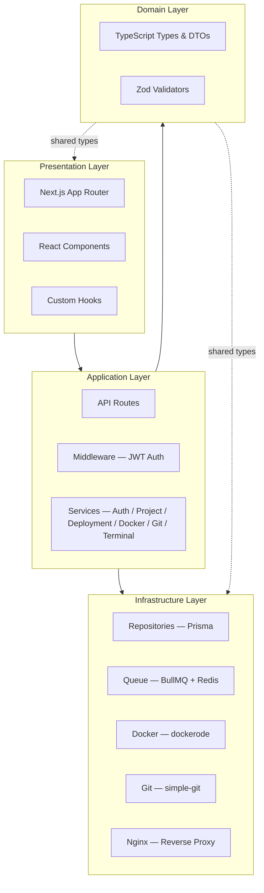
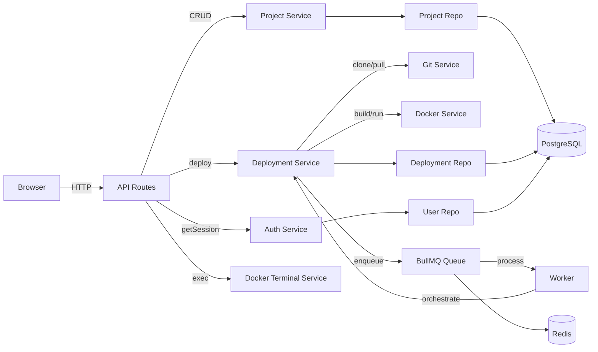
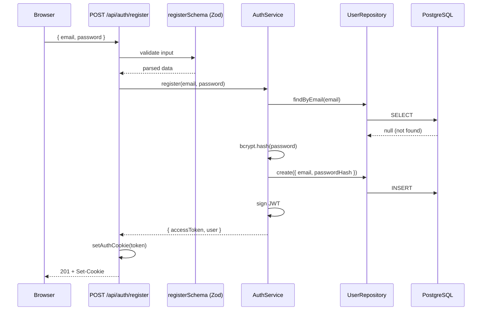
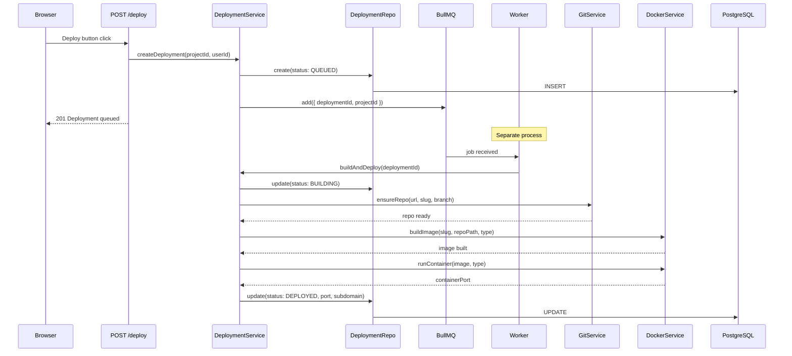
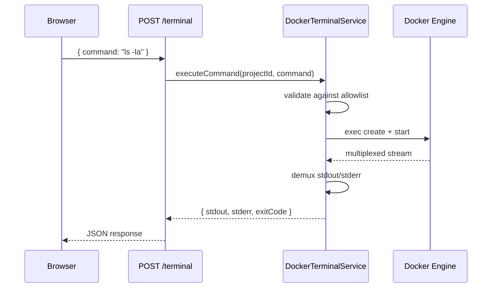

# Architecture & Folder Structure

> Scalable 4-layer architecture aligned with the [PRD](./PRD.md).
> For end-to-end runtime behavior, see [HOW-IT-WORKS.md](./HOW-IT-WORKS.md).

---

## 1. High-Level Architecture



| Layer | Responsibility | Key Rule |
|-------|---------------|----------|
| **Presentation** | Pages, components, hooks | No business logic — only renders data and dispatches actions |
| **Application** | API handlers + services | Orchestrates domain logic; validates input via Zod |
| **Domain** | Types, DTOs, validators | Pure definitions — no I/O, no side effects |
| **Infrastructure** | DB, queue, Docker, Git | All external I/O lives here; accessed only through interfaces |

---

## 2. Component Interaction



---

## 3. Folder Structure

```
dropDeploy/
├── src/
│   ├── app/                           # Next.js App Router
│   │   ├── (auth)/                    # Auth route group
│   │   │   ├── login/page.tsx
│   │   │   ├── register/page.tsx
│   │   │   └── layout.tsx
│   │   ├── (dashboard)/               # Protected routes
│   │   │   ├── dashboard/page.tsx
│   │   │   ├── projects/[id]/page.tsx # Project detail (3 tabs)
│   │   │   └── layout.tsx
│   │   ├── api/
│   │   │   ├── auth/                  # login, logout, register, session
│   │   │   ├── projects/
│   │   │   │   ├── route.ts           # GET (list) / POST (create)
│   │   │   │   └── [id]/
│   │   │   │       ├── route.ts       # GET / PATCH / DELETE
│   │   │   │       ├── deploy/route.ts
│   │   │   │       └── terminal/route.ts
│   │   │   └── health/route.ts
│   │   ├── globals.css
│   │   ├── layout.tsx
│   │   └── page.tsx                   # Landing page
│   │
│   ├── components/
│   │   ├── ui/                        # Reusable primitives (Button, Card, ...)
│   │   ├── features/                  # Feature components
│   │   │   ├── auth-header.tsx
│   │   │   ├── create-project-form.tsx
│   │   │   ├── dashboard-nav.tsx
│   │   │   ├── project-list.tsx       # Auto-polling project grid
│   │   │   ├── project-tile.tsx       # Status badge + deploy button
│   │   │   └── terminal.tsx           # Interactive container terminal
│   │   └── layouts/
│   │
│   ├── hooks/
│   │   ├── use-fetch-mutation.ts      # Generic API mutation hook
│   │   ├── use-terminal.ts            # Terminal state + command execution
│   │   └── index.ts
│   │
│   ├── lib/                           # Shared utilities & infra clients
│   │   ├── api-error.ts               # Centralized error → HTTP response
│   │   ├── auth-cookie.ts             # httpOnly cookie management
│   │   ├── config.ts                  # Zod-validated env (PROJECTS_DIR, DOCKER_DATA_DIR, ...)
│   │   ├── errors.ts                  # AppError hierarchy
│   │   ├── get-session.ts             # JWT → { userId } extraction
│   │   ├── local-ip.ts               # WebRTC-based local IP detection
│   │   ├── prisma.ts                  # Singleton Prisma client
│   │   ├── queue.ts                   # IDeploymentQueue interface + BullMQ impl
│   │   ├── redis.ts                   # ioredis connection factory
│   │   └── utils.ts                   # cn(), slugify(), sleep()
│   │
│   ├── repositories/                  # Data access layer
│   │   ├── user.repository.ts         # IUserRepository + implementation
│   │   ├── project.repository.ts      # IProjectRepository + slug uniqueness
│   │   ├── deployment.repository.ts   # IDeploymentRepository + subdomain transfer
│   │   └── index.ts
│   │
│   ├── services/                      # Business logic
│   │   ├── auth/                      # Register, login, JWT signing/verify
│   │   ├── project/                   # CRUD with ownership checks
│   │   ├── deployment/                # Orchestrates the full build pipeline
│   │   ├── docker/
│   │   │   ├── docker.service.ts      # Build image + run container
│   │   │   ├── docker-terminal.service.ts  # Exec commands in containers
│   │   │   ├── dockerfile.templates.ts     # Per-type Dockerfile strings
│   │   │   ├── nextjs-config-patcher.ts    # ESM/CJS config patching
│   │   │   └── index.ts
│   │   └── git/
│   │       ├── git.service.ts         # Clone-once + branch switching
│   │       └── index.ts
│   │
│   ├── types/                         # Domain types & DTOs
│   │   ├── api.types.ts               # ApiResponse<T>, PaginatedResponse
│   │   ├── deployment.types.ts        # DeploymentStatus, DeploymentJob
│   │   ├── project.types.ts           # ProjectType, CreateProjectDto
│   │   └── index.ts
│   │
│   ├── validators/                    # Zod schemas
│   │   ├── auth.validator.ts          # registerSchema, loginSchema
│   │   ├── project.validator.ts       # createProjectSchema, updateProjectSchema
│   │   └── index.ts
│   │
│   └── workers/
│       └── deployment.worker.ts       # BullMQ worker (concurrency: 5)
│
├── prisma/
│   └── schema.prisma                  # User, Project, Deployment models
├── docker/
│   ├── templates/                     # Dockerfile templates per project type
│   └── nginx/                         # Reverse-proxy config
├── scripts/
│   └── setup-dev.sh
└── docs/
    ├── PRD.md                         # Product requirements
    ├── ARCHITECTURE.md                # This file
    ├── HOW-IT-WORKS.md                # End-to-end runtime behavior
    ├── TODO.md                        # Improvement roadmap
    └── learn.md                       # Codebase learning guide
```

---

## 4. Key Conventions

| Concern | Convention |
|---------|-----------|
| **HTTP handling** | API routes parse body → validate with Zod → call service → return JSON |
| **Error handling** | Custom `AppError` hierarchy (`lib/errors.ts`) caught by `handleApiError()` (`lib/api-error.ts`) |
| **DB access** | Only through repositories — no Prisma imports in API routes or components |
| **Queue** | `IDeploymentQueue` interface in `lib/queue.ts`; BullMQ implementation behind it |
| **Auth** | JWT (HS256 via `jose`) stored in httpOnly `auth-token` cookie |
| **Session** | `getSession(req)` extracts `{ userId }` from JWT; every protected route calls it |
| **Config** | Centralized Zod-validated env in `lib/config.ts` via `getConfig()` |
| **DI pattern** | Services take dependencies via constructor; export both the class and a wired singleton |
| **Repo pattern** | Each repository defines an interface (e.g., `IUserRepository`) in the same file as its implementation |
| **Authorization** | Services check `resource.userId === session.userId`; return 404 (not 403) to hide existence |

---

## 5. Data Flow Examples

### Authentication (register)



### Deployment (trigger → live URL)



### Terminal command



---

## 6. Scaling the Codebase

| Adding... | Where to put it |
|-----------|----------------|
| New feature service | `services/<feature>/` with constructor DI |
| New database entity | `prisma/schema.prisma` + `repositories/<entity>.repository.ts` |
| New API endpoint | `app/api/<resource>/route.ts` |
| New UI feature | `components/features/<feature>.tsx` |
| New React hook | `hooks/use-<feature>.ts` |
| New background job | `workers/<job>.worker.ts` + queue in `lib/queue.ts` |
| New config variable | Add to Zod schema in `lib/config.ts` |

---

## 7. PRD Mapping

| PRD Section | Implementation |
|-------------|----------------|
| 5.1 Auth | `AuthService`, JWT, `UserRepository`, `/api/auth/*` |
| 5.2 Projects | `ProjectService`, `ProjectRepository`, `GitService` |
| 5.3 Type Detection | `ProjectType` enum, `DOCKERFILE_TEMPLATES` in `services/docker/` |
| 5.4 Build & Deploy | `DeploymentService`, `DockerService`, `GitService`, `deployment.worker.ts` |
| 5.5 Status | `DeploymentStatus` enum, `buildStep` tracking (CLONING / BUILDING_IMAGE / STARTING) |
| 5.6 URLs | Subdomain routing via Nginx, `BASE_DOMAIN` in config |
| 5.7 Branches | `project.branch` field, `GitService.ensureRepo()` with branch switching |
| 5.8 Terminal | `DockerTerminalService`, `/api/projects/:id/terminal`, slash commands |
