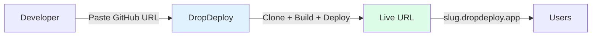
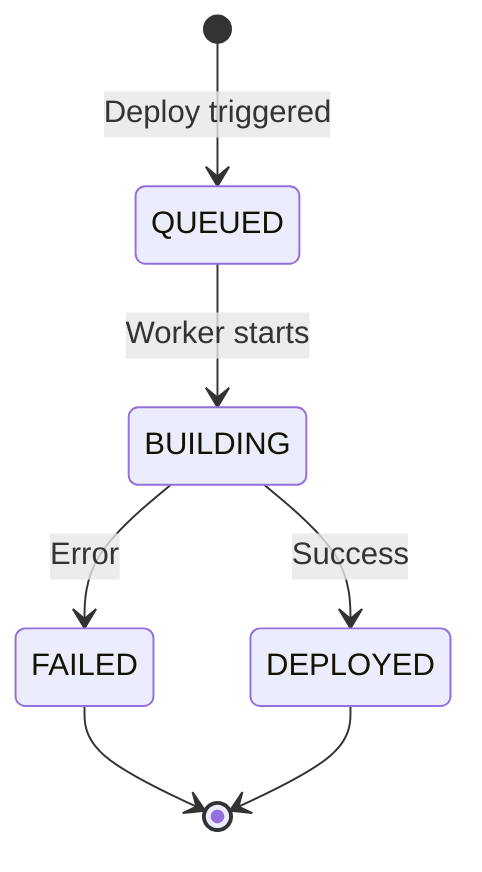
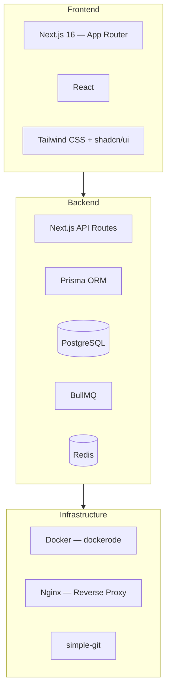

# Product Requirements Document (PRD)

**Product:** DropDeploy

---

## 1. Objective

Build a web platform that allows users to **deploy projects instantly** by pasting a GitHub repository URL. The system automatically builds, deploys, and hosts the project, returning a **publicly accessible URL**.

---

## 2. Goals & Non-Goals

### Goals (MVP)

- GitHub repo deployment via URL
- Automatic project type detection (Static, Node.js, Next.js, Django)
- Containerized build and runtime (Docker)
- Live deployment URL via subdomain
- Build status tracking with step-by-step progress
- Configurable deploy branch per project
- Interactive terminal for deployed containers
- Local network access URLs
- Secure execution environment

### Non-Goals (Out of Scope)

- Custom domains
- Billing & subscriptions
- Autoscaling
- Secrets management UI
- Multi-region hosting

---

## 3. Target Users

| Audience | Use Case |
|----------|----------|
| **Frontend developers** | Quick deploy for prototypes and side projects |
| **Students & learners** | Deploy class projects and learning exercises |
| **Hackathon participants** | Rapid deployment during time-constrained events |
| **Internal/QA teams** | Preview builds for review and testing |

---

## 4. User Stories

### US-1: Deploy GitHub Repo
As a user, I want to paste a GitHub repository URL and deploy it automatically.

### US-2: Track Deployment
As a user, I want to see build progress with step-by-step indicators (cloning, building, starting) in real time.

### US-3: Access Deployed App
As a user, I want a stable URL to access my deployed project, plus a local network URL for testing on other devices.

### US-4: Choose Deploy Branch
As a user, I want to select which git branch to deploy and switch branches between deploys.

### US-5: Container Terminal
As a user, I want to run commands inside my deployed container to debug issues, view logs, and inspect the environment.

---

## 5. Functional Requirements

### 5.1 Authentication

- Email & password authentication (MVP)
- JWT-based sessions stored in httpOnly cookies
- Session validation and logout endpoints
- One user can manage multiple projects

### 5.2 Project Creation

**GitHub Mode:**
- Public repositories only (MVP)
- Clone via HTTPS
- Validate repository availability
- Configurable deploy branch (default: `main`)

**Upload Mode** (future):
- Drag & drop folder upload (client-side zip)
- Max upload size: 100 MB
- Basic structure validation

### 5.3 Project Type Detection

| Detected File | Project Type |
|--------------|-------------|
| `index.html` | Static Site |
| `package.json` | Node.js |
| `next.config.js` | Next.js |
| `requirements.txt` + `manage.py` | Django |

### 5.4 Build & Deployment

- Each deployment runs in an **isolated Docker container**
- Dockerfile generated dynamically based on project type
- Build image → run container → assign port
- Random available host port (8000--9999)
- Map project slug to subdomain
- Clone-once strategy: repos persist locally for faster rebuilds
- Branch switching supported between deploys

### 5.5 Deployment Status

**Build steps:** `CLONING` → `BUILDING_IMAGE` → `STARTING`

**Timing:** `startedAt` (worker begins) and `completedAt` (success or failure)

**Logs:** Build & error logs persisted in the deployment record.

### 5.6 URL Management

- Auto-generated subdomain: `https://{slug}.dropdeploy.app`
- Nginx routes subdomain traffic to the correct container port
- Local network URL: `http://<local-ip>:<port>` for same-network access

### 5.7 Branch Management

- Each project stores a configurable `branch` field (default: `main`)
- Branch can be changed in project settings
- Redeploying after a branch change checks out the new branch
- Git service handles shallow/unshallow conversion for branch discovery

### 5.8 Interactive Terminal

- Execute shell commands inside deployed containers
- Built-in slash commands: `/show-logs`, `/tail-logs`, `/env`, `/files`, `/help`
- Command allowlist for safety
- 30-second timeout per command
- Terminal UI with command history, autocomplete, and resizable output

---

## 6. Non-Functional Requirements

### Performance

- Deployment start time < 10 seconds
- Static site deployment < 30 seconds
- Subsequent deploys faster due to persistent repo clones

### Security

- Docker sandboxing with resource limits (512 MB memory, CPU shares)
- Non-root containers
- Terminal command allowlist
- No host filesystem access from containers

### Reliability

- Build failures must not impact other deployments
- Retry-safe deployment jobs (3 retries, exponential backoff)
- Graceful degradation when Redis is unavailable

---

## 7. Tech Stack

| Layer | Technologies |
|-------|-------------|
| **Frontend** | Next.js 16 (App Router), React, Tailwind CSS, shadcn/ui |
| **Backend** | Next.js API Routes, Prisma ORM, PostgreSQL, BullMQ + Redis |
| **Infrastructure** | Docker (dockerode), Nginx, simple-git, single VPS (MVP) |
