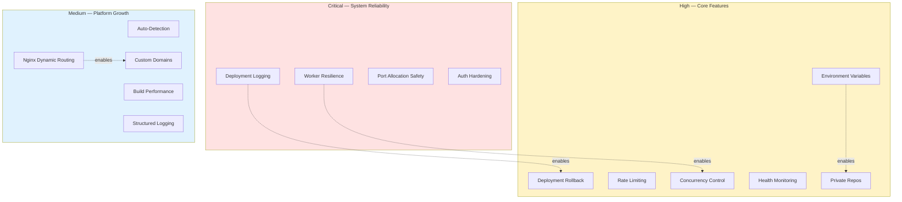

# Improvement Roadmap

> Actionable improvements organized by priority. Each item includes context on why it matters.

---

## Priority Overview

---

## Critical

### Deployment Logging & Observability

- [ ] Store full Docker build logs in database (not just last error)
- [ ] Capture stdout/stderr separately with timestamps during build
- [ ] Add log viewer UI on the project detail page per deployment
- [ ] Show real-time build output (SSE or polling) instead of just step indicators

> Currently only ~20 lines of build output are captured. Users can't debug failed builds without full logs.

### Worker Resilience

- [ ] Mark stuck `BUILDING` deployments as `FAILED` on worker restart
- [ ] Implement per-job timeout (long builds like Next.js can exceed defaults)
- [ ] Add worker health heartbeat tracked in Redis
- [ ] Add dead-letter queue UI for manually retrying permanently failed jobs

> If the worker crashes mid-build, deployments stay in `BUILDING` forever.

### Port Allocation Safety

- [ ] Check port availability before assigning (current random selection can collide)
- [ ] Track allocated ports in database with release-on-container-stop
- [ ] Handle port conflicts gracefully instead of failing silently

### Auth Hardening

- [ ] Implement refresh token rotation (short-lived access + long-lived refresh)
- [ ] Add token revocation on logout (store revoked tokens in Redis with TTL)
- [ ] Verify `httpOnly`, `secure`, `sameSite=strict` flags are set consistently

---

## High

### Deployment Rollback

- [ ] Track `previousDeploymentId` on each deployment
- [ ] Add `POST /api/projects/:id/rollback/:deploymentId` endpoint
- [ ] Keep previous container available (tagged with version) until rollback window expires
- [ ] Add rollback button in project detail UI

### Environment Variables

- [ ] Add `EnvironmentVariable` model (projectId, key, encryptedValue)
- [ ] Pass env vars to Docker container at runtime via `--env`
- [ ] Add env var editor UI in project settings
- [ ] Support `.env` file upload
- [ ] Mask values in UI and logs

> Most requested feature — users need DB URLs, API keys, and config without hardcoding.

### Rate Limiting & Resource Quotas

- [ ] Per-user deployment rate limit (e.g., 10/hour) via Redis
- [ ] Limit 1 active deployment per project (queue subsequent triggers)
- [ ] Per-user container limit (e.g., 5 running containers)
- [ ] Auto-cleanup of deployments older than 30 days

### Deployment Concurrency Control

- [ ] Per-project deployment lock (Redis or DB advisory lock)
- [ ] Queue new deploy requests while one is in progress
- [ ] Show "deployment in progress" indicator to prevent double-clicks
- [ ] Cancel queued deployment if a newer one is triggered

### Container Health Monitoring

- [ ] Add health check to generated Dockerfiles
- [ ] Poll container health status and expose in UI
- [ ] Auto-restart crashed containers (Docker restart policy: `on-failure:3`)
- [ ] Alert user when container is unhealthy or stopped

### Private Repository Support

- [ ] GitHub OAuth token for private repo cloning
- [ ] SSH deploy key support per project
- [ ] Store credentials encrypted in database
- [ ] Credential management UI in project settings

---

## Medium

### Project Type Auto-Detection

- [ ] Parse `package.json` on clone to detect framework
- [ ] Auto-detect based on file presence (`index.html`, `manage.py`, etc.)
- [ ] Show detected type to user for confirmation before first deploy
- [ ] Add more types: Flask, Go, Rust, Java/Spring

### Build Performance

- [ ] Enable Docker BuildKit (`DOCKER_BUILDKIT=1`) for layer caching
- [ ] Cache `node_modules` and `pip` packages across builds via Docker volumes
- [ ] Add build time tracking and display in deployment history
- [ ] Support custom Dockerfile (user-provided in repo root)

### Custom Domains

- [ ] Add `CustomDomain` model with DNS validation state
- [ ] CNAME verification endpoint
- [ ] Auto-provision SSL via Let's Encrypt (certbot)
- [ ] Generate Nginx config per custom domain
- [ ] Domain management UI with status indicators

### Nginx Dynamic Routing

- [ ] Auto-generate Nginx config on deployment (currently manual)
- [ ] Reload Nginx after each successful deployment
- [ ] Support WebSocket proxying for real-time apps
- [ ] Add HTTPS redirect and HSTS headers

### Structured Logging

- [ ] Replace `console.log` with structured logger (pino or winston)
- [ ] Add request ID tracing across API → service → worker
- [ ] Audit log table for user actions (deploy, delete, settings change)
- [ ] Log level configuration via env var

### Database Resilience

- [ ] Connection pooling (PgBouncer or Prisma pool settings)
- [ ] Query timeout configuration
- [ ] Indexes on frequently queried fields (`project.userId`, `deployment.projectId`, `deployment.status`)
- [ ] Automated daily backups

### Deployment History UI

- [ ] Paginated deployment history per project
- [ ] Show build duration, branch, commit hash per deployment
- [ ] Diff view between deployments
- [ ] "Redeploy" button on historical deployments

---

## Low

### Testing

- [ ] Unit tests for services (auth, deployment, docker, git)
- [ ] Integration tests for API routes
- [ ] E2E test for full deploy flow (create → deploy → verify URL)
- [ ] CI pipeline (GitHub Actions) with test + type-check
- [ ] Test coverage tracking

### Team & Collaboration

- [ ] `Team` model with member roles (admin, developer, viewer)
- [ ] Project sharing with role-based permissions
- [ ] Deployment approval workflow for production projects
- [ ] Activity feed showing team actions

### Developer Experience

- [ ] `docker-compose.yml` for local dev (PostgreSQL + Redis)
- [ ] Database seed script with sample data
- [ ] Pre-commit hooks (lint + type-check)
- [ ] `.devcontainer.json` for VS Code dev containers

### API & Integrations

- [ ] Webhook notifications for deployment events
- [ ] GitHub webhook for auto-deploy on push
- [ ] Slack/Discord notification integration

### UI Polish

- [ ] Onboarding wizard for first-time users
- [ ] Project analytics (uptime, deploy frequency, build time trends)
- [ ] Mobile responsiveness improvements
- [ ] Keyboard shortcuts (D = deploy, R = rollback, T = terminal)
- [ ] Global error boundary with retry

### Performance

- [ ] Redis caching for project list and detail queries
- [ ] HTTP cache headers (ETag, Cache-Control) on API responses
- [ ] Pagination on all list endpoints
- [ ] Lazy-load deployment history and terminal output

---

## Quick Wins

High impact, achievable in a single session:

| # | Item | What to do |
|---|------|-----------|
| 1 | **Docker BuildKit** | Set `DOCKER_BUILDKIT=1` in worker env for faster builds |
| 2 | **Container restart policy** | Add `RestartPolicy: { Name: 'on-failure', MaximumRetryCount: 3 }` |
| 3 | **Deployment lock** | Check for active `BUILDING` deployment before creating new one |
| 4 | **Stuck deployment cleanup** | On worker startup, mark any `BUILDING` deployments as `FAILED` |
| 5 | **Build duration display** | Calculate from `startedAt`/`completedAt` and show in UI |
| 6 | **Commit hash tracking** | Store HEAD commit SHA after clone/pull in deployment record |
| 7 | **Port collision check** | Query database for in-use ports before assigning |
| 8 | **Deployment cancel** | Endpoint to cancel `QUEUED` deployments before worker picks them up |
