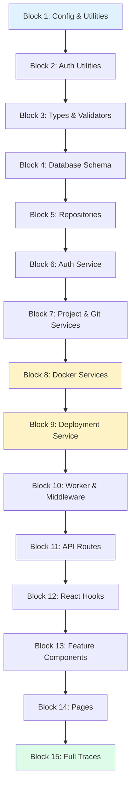
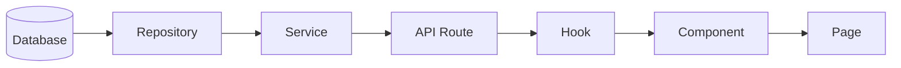
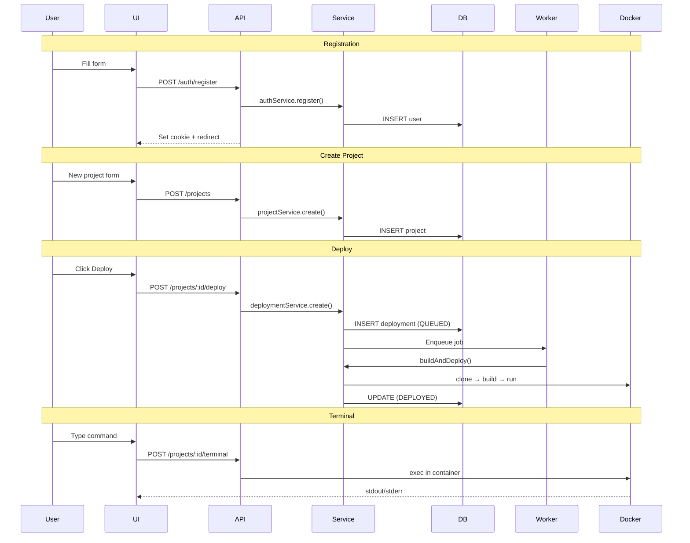

# Learn the Codebase

> A step-by-step guide to understand the entire DropDeploy codebase.
> Work through each block in order -- each one builds on the previous.

---

## How to Use This Guide

1. Read each file listed in the block.
2. Understand the **key concepts** for that block.
3. Answer the **checkpoint question** before moving on.
4. Check the box when you're confident.

**Estimated total:** ~4-5 hours of focused reading.

---

## Learning Path



**Legend:** Blue = foundation, Yellow = core system, Green = integration

---

## Data Flow Reference

Keep this in mind as you read -- data flows bottom-up through the layers:



---

## Block 1: Configuration & Utilities

> Foundation layer. Everything else imports from here.

- [ ] **`src/lib/config.ts`** -- Zod-validated environment variables with defaults. `getConfig()` returns a typed config singleton. Key vars: `JWT_SECRET`, `DATABASE_URL`, `REDIS_HOST`, `PROJECTS_DIR`, `DOCKER_DATA_DIR`.
  - **Learn:** Zod schema validation, singleton pattern, environment configuration

- [ ] **`src/lib/errors.ts`** -- Custom error hierarchy: `AppError` → `ValidationError`, `NotFoundError`, `UnauthorizedError`, `ForbiddenError`, `ConflictError`. Each has an HTTP status code and `isOperational` flag.
  - **Learn:** Custom error classes, error hierarchy, operational vs programmer errors

- [ ] **`src/lib/utils.ts`** -- `cn()` merges Tailwind classes (shadcn pattern), `slugify()` converts names to URL slugs, `sleep()` provides promise-based delays.
  - **Learn:** clsx + tailwind-merge, slug generation

- [ ] **`src/lib/prisma.ts`** -- Singleton Prisma client stored on `globalThis` to survive hot reload in development.
  - **Learn:** Prisma ORM basics, singleton in Next.js dev mode

- [ ] **`src/lib/redis.ts`** -- `getRedisConnection()` factory using ioredis, configured from `REDIS_HOST` and `REDIS_PORT`.
  - **Learn:** Redis connection, ioredis library

- [ ] **`src/lib/api-error.ts`** -- `handleApiError()` catches `AppError` and `ZodError`, returns JSON with the correct HTTP status. Used by every API route's catch block.
  - **Learn:** Centralized error handling, Zod error formatting

**Checkpoint:** *How does a validation error in an API route become an HTTP 400 response with a message?*

---

## Block 2: Auth Utilities

> How users are identified across requests. Read these before the auth service.

- [ ] **`src/lib/auth-cookie.ts`** -- `setAuthCookie()` / `clearAuthCookie()` / `getTokenFromCookie()`. Parses duration strings like `"7d"` into seconds. Sets `httpOnly`, `secure`, `sameSite` flags.
  - **Learn:** Secure cookie management, JWT storage strategy

- [ ] **`src/lib/get-session.ts`** -- `getSession(req)` extracts JWT from cookie, verifies it, returns `{ userId }`. Throws `UnauthorizedError` if missing or invalid.
  - **Learn:** Session extraction pattern, request authentication

- [ ] **`src/lib/local-ip.ts`** -- Client-side: uses WebRTC ICE candidates to detect local IP. Exports `useLocalIP()` React hook.
  - **Learn:** WebRTC trick for IP detection, client-side hooks

**Checkpoint:** *Trace the path: user sends a request → how does the server know who they are?*

---

## Block 3: Types & Validators

> The domain language. These files define shapes -- no logic, just definitions.

- [ ] **`src/types/api.types.ts`** -- `ApiResponse<T>` envelope: `{ success, data?, error? }`. `PaginatedResponse<T>`, `PaginationParams`.
  - **Learn:** Generic response types, API contract design

- [ ] **`src/types/project.types.ts`** -- `ProjectType` enum (STATIC, NODEJS, NEXTJS, DJANGO), `SourceType` (GITHUB), DTOs: `CreateProjectDto`, `UpdateProjectDto`.
  - **Learn:** Domain types, DTO pattern, enum modeling

- [ ] **`src/types/deployment.types.ts`** -- `DeploymentStatus` (QUEUED → BUILDING → DEPLOYED / FAILED), `DeploymentJob` (BullMQ job payload).
  - **Learn:** State machine as enum, job payload design

- [ ] **`src/validators/auth.validator.ts`** -- `registerSchema` / `loginSchema` with Zod. Email validation, password min length.
  - **Learn:** Zod schema definition, type inference with `z.infer`

- [ ] **`src/validators/project.validator.ts`** -- `createProjectSchema` / `updateProjectSchema`. URL validation, optional branch field.
  - **Learn:** Partial schemas for updates, field-level validation

**Checkpoint:** *What are all the possible states a deployment can be in? What fields does a project have?*

---

## Block 4: Database Schema

> The source of truth. Read this before repositories.

- [ ] **`prisma/schema.prisma`** -- Three models: `User`, `Project`, `Deployment`. Relationships: User 1→N Project 1→N Deployment. Key unique constraints: `slug`, `subdomain`. Enums: `ProjectType`, `DeploymentStatus`.
  - **Learn:** Prisma schema syntax, relations, unique constraints, enums, default values

**Checkpoint:** *Draw the ER diagram from memory. What columns have unique constraints and why?*

---

## Block 5: Repositories

> Data access layer. Each repository wraps Prisma for one model.
> Pattern: interface + class + singleton export.

- [ ] **`src/repositories/user.repository.ts`** -- `IUserRepository` interface: `findById`, `findByEmail`, `create`. Email normalized to lowercase on create.
  - **Learn:** Repository pattern, interface-first design

- [ ] **`src/repositories/project.repository.ts`** -- Slug generation with uniqueness check (appends `-2`, `-3`, etc.). `findByUserId()` includes latest deployment. `create()` handles branch defaulting.
  - **Learn:** Slug uniqueness, Prisma include/select, related data loading

- [ ] **`src/repositories/deployment.repository.ts`** -- `clearSubdomain()` nullifies old subdomain before assigning to new deployment. `updateStatus()` with partial field updates.
  - **Learn:** Subdomain transfer logic, partial updates

**Checkpoint:** *Why does `clearSubdomain()` exist? What would break without it?*

---

## Block 6: Auth Service

> First service to study. Shows the constructor DI pattern used everywhere.

- [ ] **`src/services/auth/auth.service.ts`** -- Constructor takes `IUserRepository` + config. `register()`: hash → create → sign JWT. `login()`: find → verify → sign JWT. `verifyToken()`: validate JWT, return payload. Exports both class and wired singleton.
  - **Learn:** bcrypt hashing, JWT signing with jose, constructor dependency injection

**Checkpoint:** *How is the JWT created? What's in the payload? How is the password stored?*

---

## Block 7: Project & Git Services

> How projects are managed and how code is fetched from GitHub.

- [ ] **`src/services/project/project.service.ts`** -- CRUD with authorization: every method checks `project.userId === userId`. Returns 404 (not 403) to hide resource existence.
  - **Learn:** Service authorization pattern, information hiding

- [ ] **`src/services/git/git.service.ts`** -- `ensureRepo(url, slug, branch)` implements clone-once strategy:

  ```mermaid
  flowchart TD
      A{Repo exists?} -->|No| B[Clone]
      A -->|Yes| C[Fetch + Checkout + Reset]
      B --> D[Ready]
      C --> D
  ```

  First deploy: `git clone`. Subsequent: fetch → unshallow if needed → checkout → hard-reset to `origin/<branch>`.
  - **Learn:** simple-git library, clone-once pattern, branch switching

**Checkpoint:** *What happens on the 3rd deploy of the same project? Does it clone again?*

---

## Block 8: Docker Services

> The core of the deployment platform. Three files, read in order.

- [ ] **`src/services/docker/dockerfile.templates.ts`** -- `DOCKERFILE_TEMPLATES` maps each project type to a Dockerfile string. `CONTAINER_PORTS` maps type to internal port (80, 3000, 8000). Next.js uses multi-stage build.
  - **Learn:** Dockerfile patterns, multi-stage builds, port mapping

- [ ] **`src/services/docker/nextjs-config-patcher.ts`** -- Detects ESM vs CJS `next.config` and patches it. Disables eslint/typescript errors during build.
  - **Learn:** Config file patching, ESM/CJS detection

- [ ] **`src/services/docker/docker.service.ts`** -- `buildImage()`: write Dockerfile → build via dockerode → follow stream → verify image. `runContainer()`: pick random host port (8000-9999) → create container with memory/CPU limits → start. `stopAndRemoveContainer()`: cleanup.
  - **Learn:** dockerode API, image building, container lifecycle, resource limits

- [ ] **`src/services/docker/docker-terminal.service.ts`** -- `executeCommand()`: validate against allowlist → Docker exec → demux stdout/stderr. `executeSlashCommand()`: routes `/show-logs`, `/env`, `/files`, `/help`. Docker stream demultiplexing (8-byte header protocol).
  - **Learn:** Docker exec API, command allowlisting, stream demuxing, slash commands

**Checkpoint:** *Trace a Docker build: what gets written to disk, what API calls are made, how is the image verified?*

---

## Block 9: Deployment Service (Orchestrator)

> The brain. Ties git, docker, and the database together.

- [ ] **`src/services/deployment/deployment.service.ts`**

  **`createDeployment()`:** Verify ownership → create DB record (QUEUED) → enqueue BullMQ job → graceful fallback if Redis is down.

  **`buildAndDeploy()`:** The full pipeline:

  ```mermaid
  flowchart LR
      A[BUILDING] --> B[CLONING]
      B --> C[BUILDING_IMAGE]
      C --> D[STARTING]
      D --> E[DEPLOYED]
      B -.-> F[FAILED]
      C -.-> F
      D -.-> F
  ```

  1. Set status `BUILDING` + `startedAt`
  2. buildStep `CLONING` → `gitService.ensureRepo()`
  3. buildStep `BUILDING_IMAGE` → `dockerService.buildImage()`
  4. buildStep `STARTING` → `dockerService.runContainer()`
  5. Clear old subdomain → set `DEPLOYED` + `completedAt`

  On failure: set `FAILED` + log error + `completedAt`
  - **Learn:** Orchestration pattern, state machine transitions, error recovery

**Checkpoint:** *What happens if Docker build fails at step 3? What state is the deployment in?*

---

## Block 10: Worker & Middleware

> How background jobs run and how routes are protected.

- [ ] **`src/workers/deployment.worker.ts`** -- Separate process via `npm run worker`. BullMQ Worker with concurrency 5. Calls `deploymentService.buildAndDeploy()` per job.
  - **Learn:** BullMQ worker pattern, background processing, concurrency

- [ ] **`src/middleware.ts`** -- Next.js middleware for route protection. Protects `/dashboard/*` → redirects to `/login` if no valid JWT. Redirects `/login`, `/register` to `/dashboard` if already authenticated. Uses `jose` to verify JWT directly.
  - **Learn:** Next.js middleware, route protection, edge runtime constraints

**Checkpoint:** *What happens when an unauthenticated user visits /dashboard/projects/abc?*

---

## Block 11: API Routes

> HTTP layer. Each route: validate input → call service → return JSON.

- [ ] **`src/app/api/auth/register/route.ts`** -- Parse body → validate with `registerSchema` → `authService.register()` → set cookie → return tokens.
- [ ] **`src/app/api/auth/login/route.ts`** -- Same pattern, calls `authService.login()`.
- [ ] **`src/app/api/auth/logout/route.ts`** -- Clears auth cookie, returns success.
- [ ] **`src/app/api/auth/session/route.ts`** -- Returns current user or null (doesn't throw on missing token).
- [ ] **`src/app/api/projects/route.ts`** -- GET: list user's projects. POST: create project. Both require `getSession()`.
- [ ] **`src/app/api/projects/[id]/route.ts`** -- GET / PATCH / DELETE for a single project.
- [ ] **`src/app/api/projects/[id]/deploy/route.ts`** -- POST: triggers deployment.
- [ ] **`src/app/api/projects/[id]/terminal/route.ts`** -- POST: executes command in container, routes slash vs regular commands.

**Checkpoint:** *What's the consistent pattern across all routes? (hint: try/catch, getSession, service call, handleApiError)*

---

## Block 12: React Hooks

> Client-side logic extracted into reusable hooks.

- [ ] **`src/hooks/use-fetch-mutation.ts`** -- Generic hook for API mutations (POST/PATCH/DELETE). Manages loading, error, data state. Supports JSON and FormData.
  - **Learn:** Custom hooks, TypeScript generics, fetch abstraction

- [ ] **`src/hooks/use-terminal.ts`** -- Manages terminal entries (command + output history). Handles command execution, abort, and loading state.
  - **Learn:** Stateful hooks, AbortController, async patterns

**Checkpoint:** *How does `useFetchMutation` differ from just calling `fetch()`? What state does it manage?*

---

## Block 13: Feature Components

> UI building blocks that compose hooks + UI primitives.

- [ ] **`src/components/features/create-project-form.tsx`** -- Form with name, description, GitHub URL, branch, framework selector. Client-side validation before submit.
  - **Learn:** Controlled form pattern, framework selection UI

- [ ] **`src/components/features/project-tile.tsx`** -- Card showing project name, status badge, deploy button, live URL. Build progress indicators (checkmark/spinner/circle per step).
  - **Learn:** Status visualization, conditional rendering

- [ ] **`src/components/features/project-list.tsx`** -- Lists projects with auto-polling (2.5s) when any deployment is in progress. Stops polling when all deployments are stable.
  - **Learn:** Polling pattern, interval management

- [ ] **`src/components/features/terminal.tsx`** -- Interactive terminal with slash command autocomplete, arrow key history, drag-to-resize, robbyrussell prompt theme.
  - **Learn:** Complex keyboard handling, drag interactions, command autocomplete

**Checkpoint:** *How does the project list know when to start/stop polling?*

---

## Block 14: Pages

> Full user-facing routes. These compose everything above.

- [ ] **`src/app/(auth)/register/page.tsx`** -- Registration form, redirects to `/dashboard` on success.
- [ ] **`src/app/(auth)/login/page.tsx`** -- Login form with `redirectFrom` query param support. Uses Suspense boundary.
- [ ] **`src/app/(dashboard)/dashboard/page.tsx`** -- Welcome banner + create project dialog + project list.
- [ ] **`src/app/(dashboard)/projects/[id]/page.tsx`** -- Three-tab layout (Overview / Settings / Advanced). The largest file in the codebase.

**Checkpoint:** *You've read the entire codebase. Trace: user registers → creates project → deploys → uses terminal. What files are involved?*

---

## Block 15: Putting It All Together

> No new files. Connect the dots by tracing complete flows.



### Trace Checklist

- [ ] **Registration:** `register/page.tsx` → `POST /api/auth/register` → `authService.register()` → `userRepository.create()` → set cookie → redirect
- [ ] **Create Project:** `dashboard/page.tsx` → `CreateProjectForm` → `POST /api/projects` → `projectService.create()` → `projectRepository.create()`
- [ ] **Deploy:** `project-tile.tsx` → `POST /api/projects/:id/deploy` → `deploymentService.createDeployment()` → BullMQ → `deployment.worker.ts` → `buildAndDeploy()` → git → Docker → DEPLOYED
- [ ] **Terminal:** `terminal.tsx` → `useTerminal` → `POST /api/projects/:id/terminal` → `dockerTerminalService.executeCommand()` → Docker exec
- [ ] **Auth Protection:** Browser → `/dashboard` → `middleware.ts` checks JWT → valid: proceed / invalid: redirect to `/login`

---

## Summary

| Layer | Files | Purpose |
|-------|-------|---------|
| `lib/` | 10 | Config, errors, DB, Redis, auth utils |
| `types/` | 3 | Domain types and DTOs |
| `validators/` | 2 | Zod input validation |
| `repositories/` | 3 | Database access |
| `services/` | 7 | Business logic (auth, project, git, docker, deployment) |
| `workers/` | 1 | Background job processing |
| `api routes/` | 8 | HTTP endpoints |
| `hooks/` | 2 | Client-side state logic |
| `components/` | 6 | UI building blocks |
| `pages/` | 4 | User-facing routes |
| **Total** | **~46** | |
